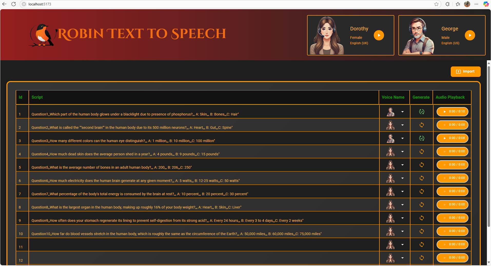

# 🎹 RobinTTSApp

**RobinTTSApp** is a cross-platform text-to-speech (TTS) application that transforms written text into lifelike speech using cutting-edge AI voice synthesis. Designed with flexibility in mind, it seamlessly integrates with cloud-based services like ElevenLabs and supports open-source alternatives such as Zonos for local deployment.

---

## 🚀 Features

- **AI-Powered Voice Synthesis**: Leverages ElevenLabs' advanced TTS API for high-quality, emotionally expressive speech generation.
- **Modular Architecture**: Easily switch between different TTS engines, including local models like Zonos.
- **Cross-Platform Compatibility**: Built with C# and TypeScript, ensuring smooth operation across various platforms.
- **User-Friendly Interface**: Intuitive UI for effortless text input and audio playback.

---

## 🧠 AI Voice Engine Options

### 🔹 ElevenLabs (Default)

RobinTTSApp utilizes [ElevenLabs](https://elevenlabs.io/) as the default TTS provider, offering:

- Support for 32 languages with nuanced intonation and emotional awareness.
- Real-time audio streaming capabilities.
- Advanced voice cloning features.

For integration details, refer to the [ElevenLabs API Documentation](https://elevenlabs.io/docs/).

### 🔸 Zonos (Local Alternative)

For those preferring a local solution, [Zonos](https://github.com/Zyphra/Zonos) offers:

- An open-weight TTS model trained on over 200k hours of multilingual speech.
- High-fidelity voice cloning with just a few seconds of reference audio.
- Emotionally expressive speech synthesis.

Explore Zonos further on their [official website](https://zonostts.com/).

---

## 🛠️ Getting Started

### Prerequisites

- .NET 6 SDK
- Node.js (for frontend development)
- ElevenLabs API Key (if using ElevenLabs)

### Installation

1. **Clone the Repository**:

   ```bash
   git clone https://github.com/Fike-Rehman/RobinTTSApp.git
   cd RobinTTSApp
   ```

2. **Configure API Keys**:

   - Create a `.env` file in the root directory.
   - Add your ElevenLabs API key:

     ```env
     ELEVENLABS_API_KEY=your_api_key_here
     ```

3. **Build and Run the Application**:

   - For the backend:

     ```bash
     dotnet build
     dotnet run
     ```

   - For the frontend:

     ```bash
     cd frontend
     npm install
     npm run start
     ```

---

## 🔄 Switching TTS Providers

To switch from ElevenLabs to Zonos:

1. **Install Zonos**:
   Follow the instructions on the [Zonos GitHub Repository](https://github.com/Zyphra/Zonos) to set up the model locally.

2. **Update Configuration**:

   - In your `.env` file, set the TTS provider:

     ```env
     TTS_PROVIDER=zonos
     ```

3. **Restart the Application**:
   Ensure the application picks up the new configuration.

---

## 📸 Screenshots



---

## 📄 License

This project is licensed under the [MIT License](LICENSE.txt).

---

## 🤝 Contributing

Contributions are welcome! Please fork the repository and submit a pull request for any enhancements or bug fixes.

---

## 📬 Contact

For questions or feedback, please open an issue on the [GitHub repository](https://github.com/Fike-Rehman/RobinTTSApp/issues).

---

_Crafted with ❤️ by Fike-Rehman_
